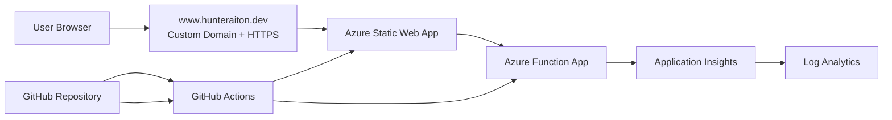

# Cloud Resume Challenge on Azure

This repository contains an Azure-based Cloud Resume Challenge project built to show practical cloud engineering, secure design decisions, and end-to-end ownership. The goal was not just to publish a resume site, but to build a portfolio project that demonstrates how frontend delivery, serverless backend logic, telemetry, CI/CD, and security controls fit together in a real Azure environment.

**Live site:** [www.hunteraiton.dev](https://www.hunteraiton.dev)

## Why this project exists

This project was built as a hands-on way to move beyond theory and turn Azure knowledge into something public, useful, and interview-ready. Instead of saying “I studied Azure Functions” or “I understand CI/CD,” this repository shows those skills through a live site, automated deployments, backend integrations, troubleshooting, and security-focused design choices.

For employers, this project is meant to show the ability to:

- Design and publish a cloud-hosted web application in Azure.
- Connect a static frontend to a serverless backend.
- Build and troubleshoot CI/CD workflows in GitHub Actions.
- Work with Azure monitoring and telemetry.
- Make better security decisions as requirements evolve.
- Document architecture, tradeoffs, and lessons learned clearly.

## What has been built

At this stage, the project includes the following major components:

- A live public resume website hosted in Azure.
- Custom domain and HTTPS for a production-style public presence.
- A frontend designed to present experience, certifications, projects, and technical focus areas.
- Azure Functions used for backend API logic.
- Azure Monitor / Application Insights / Log Analytics integration to support observability work.
- GitHub Actions workflows for frontend and backend deployment automation.
- Ongoing security hardening of the public-facing and backend portions of the project.

## Architecture overview

The project is built around a simple but realistic cloud pattern:

- **Frontend:** Static resume site hosted in Azure.
- **Backend API:** Azure Function App used for dynamic functionality.
- **Telemetry layer:** Azure Monitor, Application Insights, and Log Analytics used to analyze backend behavior and support an observability dashboard.
- **CI/CD:** GitHub Actions deploy changes from source control into Azure.
- **Domain / public access:** Public-facing site delivered over HTTPS with a custom domain.

This architecture was intentionally chosen because it reflects common real-world patterns: static delivery for low-cost public content, serverless functions for lightweight backend logic, and cloud-native telemetry for operations and troubleshooting.

## What this project demonstrates

### 1. End-to-end ownership

This is not just a frontend project. It includes cloud hosting, deployment workflows, backend API logic, telemetry integration, and production-style troubleshooting. That matters because employers are usually looking for people who can work across layers, not just write code in isolation.

### 2. Azure service integration

The project brings together multiple Azure services rather than treating Azure as a mere hosting service for static files. It uses Azure as an application platform, not just storage.

### 3. CI/CD in practice

The repository includes GitHub Actions workflows to automate deployments. That means changes are pushed through repeatable deployment steps rather than handled manually. For employers, that signals familiarity with DevOps workflows, release discipline, and operational repeatability.

### 4. Troubleshooting and iteration

A big part of this project has been debugging real problems: deployment issues, function configuration changes, telemetry query adjustments, and frontend/backend integration problems. That is valuable because real cloud work usually involves diagnosing and improving systems, not just launching them once.

### 5. Security-minded design decisions

One of the most important improvements in this project was recognizing that a frontend call with an exposed function key would be a weak design. The backend approach was revised toward a safer model: use managed identity on the backend, avoid exposing secrets client-side, and return only low-risk aggregate telemetry values instead of raw log data.

That change matters because it shows a security mindset: not just making something functional, but asking whether it should be deployed that way at all.

## Project story

The project started as a standard Azure-based Cloud Resume Challenge build: publish a resume site, connect it to cloud services, and automate deployment. From there, it evolved into something more useful for a cloud security portfolio.

Instead of stopping at a static site and a basic visitor counter, the project expanded into observability and secure backend design. A lightweight telemetry feature was added to surface operational data, including total views, success rate, and average latency. During that work, the design had to be corrected to avoid exposing sensitive access patterns in browser-visible code.

That led to a more security-aware architecture:

- The frontend calls a clean API route.
- The backend is responsible for Azure Monitor queries.
- Secrets are not embedded in public client code.
- The response is intentionally limited to harmless aggregate values.
- Troubleshooting now focuses on secure Azure access, telemetry schema, and least-privilege design.

For an employer, that story is more valuable than a perfect first draft. It shows judgment, iteration, and the ability to improve a design after identifying risk.

## Work completed so far

The following milestones have already been worked through in this repository:

- Resume site built and published in Azure.
- Repository structured for frontend, backend, API, and infrastructure-related work.
- GitHub Actions workflows created for deployment automation.
- Custom domain and public HTTPS delivery configured.
- Azure Function App deployment pipeline created and iterated on.
- Observability feature added to the site concept and integrated into the frontend.
- Backend telemetry function revised to avoid exposing function keys in browser code.
- Application Insights / Log Analytics query behavior investigated to support aggregate telemetry.
- Multiple deployment and query issues were debugged through real workflow runs and environment changes.

## Security decisions made

This project is also being used to build stronger cloud security habits. Key security decisions and improvements include:

- Avoiding client-side exposure of Azure Function keys.
- Moving toward managed identity for backend access to Azure Monitor.
- Limiting public API output to aggregate, non-sensitive statistics.
- Treating telemetry access as a server-side responsibility.
- Reviewing GitHub security settings such as CodeQL, Dependabot, and secret scanning.
- Planning additional hardening such as security headers, tighter RBAC, and stronger CI/CD identity controls.

## Lessons learned

A few lessons have already come out of the build process:

- A deployment completing successfully does not guarantee the feature is truly working end to end.
- Azure monitoring data models and table names can vary based on resource configuration, so telemetry queries must be validated against the actual environment.
- Good cloud projects are not just about service selection. They are also about identity, access, observability, and secure defaults.
- Troubleshooting is part of the signal. Employers often care just as much about how issues were diagnosed and corrected as they do about the final architecture.

## Why this matters for cloud security roles

This project is especially important as a cloud security portfolio item because it goes beyond “I deployed something in Azure.” It shows the ability to think about trust boundaries, public attack surface, secrets handling, telemetry exposure, managed identity, and secure deployment practices.

That is the kind of thinking expected in cloud security work: understanding how a system functions, where risk appears, and how to improve the design without breaking the business goal.

## Repository purpose

This repository serves two purposes:

1. It is a working Azure project used to build and refine practical cloud skills.
2. It is a public portfolio artifact that shows how cloud engineering and cloud security thinking can be applied in a real build.

The long-term goal is for this repository to be easy for recruiters, hiring managers, and technical interviewers to understand quickly: what was built, why it was built this way, what problems were solved, and what security decisions were made along the way.
